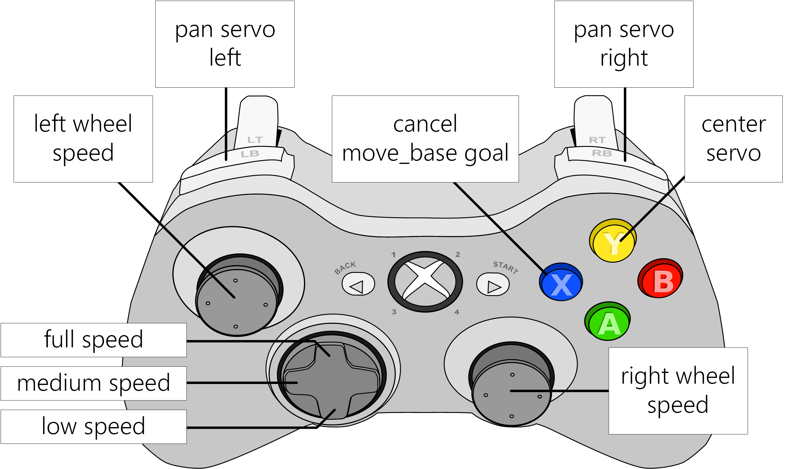

##

1. Launch ROS nodes:

```
$ roslaunch rover drive_teleop.launch joy_dev:=/dev/input/js0
$ roslaunch rover cmd_vel_mux.launch
$ roslaunch rover simple_drive.launch

OR all-in-one launch:
$ roslaunch rover drive.launch
```

